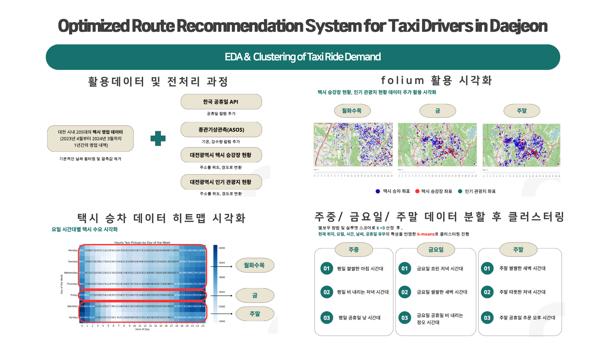
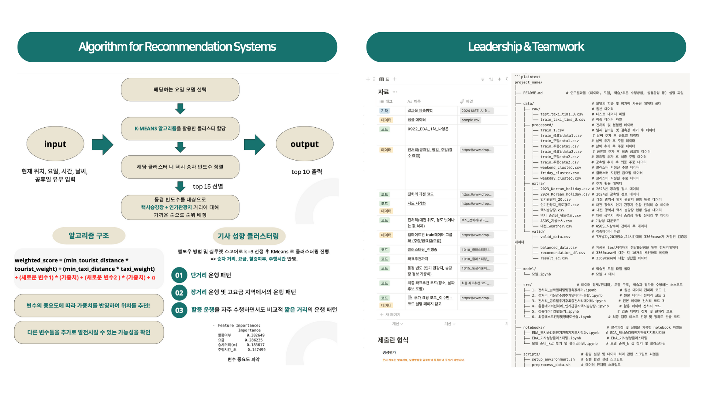
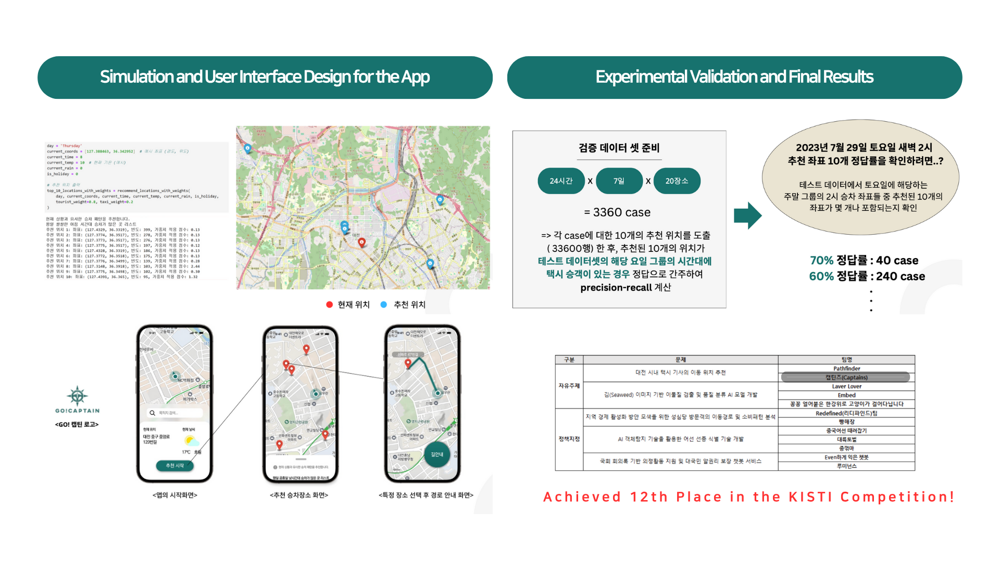

# Optimized Route Recommendation System for Taxi Drivers in Daejeon
# PROJECT SUMMARY




# 연구결과물 설명

## 1. 데이터
- **활용 데이터**: 2023년 4월부터 2024년 3월까지의 대전 시내 택시 영업 내역 데이터

  * 데이터 경로: 
    - `data/processed/weekday_clusted.csv`
    - `data/processed/friday_clusted.csv`
    - `data/processed/weekend_clusted.csv`
  
  * 추가 데이터: 
    - `data/extra/인기관광지_위도경도.csv`
    - `data/extra/택시승강장_위도경도.csv`
  
  * 특성:
    - 승차X좌표
    - 승차Y좌표
    - hour (시간)
    - 기온(°C)
    - 강수량(mm)
    - holiday (공휴일 여부)

- **추가 활용 데이터**:
  - 종관기상관측(ASOS): 기상청 기상자료 개방 포털 (기온, 강수량 정보 활용)
  - 대한민국 공휴일 데이터
  - 대전광역시 택시 승강장 현황: 공공 데이터 포털
  - 대전광역시 인기 관광지 현황: 한국 관광 데이터랩 

## 2. 모델
- **클러스터링**: 요일 시간대별 택시 수요 예측을 위한 KMeans 클러스터링 모델
  - 월~목, 금요일, 주말(토,일) 데이터를 각각 클러스터링
  - 클러스터 개수: 각 데이터셋별 최적의 클러스터 수 적용 (K=3)
  
- **K-최근접 이웃(KNN)**: 입력된 좌표, 시간, 기온, 강수량을 바탕으로 가장 가까운 클러스터를 선택 후 추천

## 3. 학습 및 추론 수행 방법

1. **모델 선택**: 입력된 요일에 따라 적절한 클러스터링 모델을 선택합니다.
2. **클러스터링 모델 학습**:
    - `KMeans` 알고리즘을 사용해 각 요일별로 클러스터링을 수행합니다.
    - 주중, 금요일, 주말에 대한 클러스터링 모델을 학습하고 저장합니다.
3. **입력 데이터 처리**: 입력된 좌표, 시간, 기온, 강수량, 공휴일 여부를 표준화합니다.
4. **클러스터 예측**: 표준화된 입력 데이터를 바탕으로 클러스터 레이블을 예측합니다.
    - 입력 데이터 (현재 좌표, 시간, 기온, 강수량)를 바탕으로 `KNN` 알고리즘을 사용해 클러스터를 예측합니다.
5. **추천 위치 제공**: 예측된 클러스터 내에서 가장 빈번한 승차 위치를 추천합니다.
    - 해당 클러스터 내에서 빈번하게 발생한 상위 10개의 택시 수요 위치를 추천합니다.
6. **가중치 적용 추천**: 인기 관광지 및 택시 승강장과의 거리 가중치를 고려하여 추천 위치를 재정렬합니다.
    - 동점일 경우, 택시 승강장 및 관광지 정보를 활용해 가중치를 부여합니다.

## 4. 실행환경
- **언어**: Python 3.8 이상
* **필수 라이브러리**:
    - pandas
    - matplotlib
    - seaborn
    - numpy
    - scikit-learn
    - folium

- **실행 방법**:
1. 데이터를 준비하고 스크립트를 실행합니다.
2. `recommend_locations` 또는 `recommend_locations_with_weights` 함수를 호출하여 추천 위치를 확인합니다.

## 5. 사용 예시
```python
# 입력 예시
day = 'Thursday'
current_coords = [127.436374, 36.332504]
current_time = 14  # 오후 2시
current_temp = 20.5  # 현재 기온
current_rain = 13  # 현재 강수량

# 추천 위치 출력
top_10_locations = recommend_locations(day, current_coords, current_time, current_temp, current_rain)
print(top_10_locations)


## 파일 구조
```plaintext
project_name/
│
├── README.md           # 연구결과물 (데이터, 모델, 학습/추론 수행방법, 실행환경 등) 설명 파일
│
├── data/                           # 모델의 학습 및 평가에 사용된 데이터 폴더
│   ├── raw/                        # 원본 데이터
│   │   ├── test_taxi_tims_U.csv    # 테스트 데이터 파일
│   │   └── train_taxi_tims_U.csv   # 학습 데이터 파일
│   ├── processed/                  # 전처리 및 분할된 데이터
│   │   ├── train_1.csv             # 날씨 필터링 및 결측값 제거 후 데이터
│   │   ├── train_금요일data1.csv     # 날씨 추가 후 금요일 데이터 
│   │   ├── train_주말data1.csv      # 날씨 추가 후 주말 데이터
│   │   ├── train_주중data1.csv      # 날씨 추가 후 주중 데이터
│   │   ├── train_금요일data2.csv     # 공휴일 추가 후 최종 금요일 데이터 
│   │   ├── train_주말data2.csv      # 공휴일 추가 후 최종 주말 데이터 
│   │   ├── train_주중data2.csv      # 공휴일 추가 후 최종 주중 데이터 
│   │   ├── weekend_clusted.csv     # 클러스터 지정된 주말 데이터 
│   │   ├── friday_clusted.csv      # 클러스터 지정된 금요일 데이터 
│   │   └── weekday_clusted.csv     # 클러스터 지정된 주중 데이터 
│   ├── extra/                      # 추가 활용 데이터 
│   │   ├── 2023_Korean_holiday.csv # 2023년 공휴일 정보 데이터 
│   │   ├── 2024_Korean_holiday.csv # 2024년 공휴일 정보 데이터 
│   │   ├── 인기관광지_20.csv          # 대전 광역시 인기 관광지 현황 원본 데이터 
│   │   ├── 인기관광지_위도경도.csv      # 대전 광역시 인기 관광지 현황 전처리 후 데이터 
│   │   ├── 택시승강장.csv             # 대전 광역시 택시 승강장 현황 원본 데이터 
│   │   ├── 택시 승강장_위도경도.csv     # 대전 광역시 택시 승강장 현황 전처리 후 데이터 
│   │   ├── ASOS_지상수치.csv         # 기상청 다운로드   
│   │   └── 대전_weather.csv         # ASOS_지상수치 전처리 후 데이터
│   └── valid/                      # 검증데이터 파일 
│       ├── valid_data.csv          # 7개날짜,20개장소,24시간대의 3360case가 저장된 검증용데이터
│       ├── balanced_data.csv       # 제공된 test데이터의 정답률산정을 위한 전처리데이터
│       ├── recommendation_df.csv   # 3360case에 대한 각 10개의 추천좌표 데이터
│       └── result_ac.csv           # 3360case에 대한 정답률 데이터
│
├── model/                          # 학습된 모델 파일 폴더
│   └── 모델.ipynb                   # 모델 + 예시  
│
├── src/                     # 데이터 정제/전처리, 모델 구조, 학습과 평가를 수행하는 소스코드
│   ├── 1. 전처리_날짜필터링및결측값제거.ipynb          # 원본 데이터 전처리 코드 1
│   ├── 2. 전처리_기온강수량추가및데이터분할.ipynb       # 원본 데이터 전처리 코드 2
│   ├── 3. 전처리_공휴일추가후최종전처리데이터.ipynb     # 원본 데이터 전처리 코드 3
│   ├── 4. 활용데이터전처리_인기관광지택시승강장.ipynb   # 활용 데이터 전처리 코드 
│   ├── 5. 검증데이터셋만들기.ipynb                 # 검증 데이터 정제 및 전처리 코드
│   └── 6. 최종테스트진행및정확도산출.ipynb   #최종 검증 테스트 진행 및 정확도 산출 코드 
│
├── notebooks/                             # 분석과정 및 실험을 기록한 notebook 파일들
│   ├── EDA_택시승강장인기관광지지도시각화.ipynb 
│   ├── EDA_기사성향클러스터링.ipynb            
│   └── 모델 준비_k값 찾기 및 클러스터링.ipynb    
│
├── scripts/                   # 환경 설정 및 데이터 처리 관련 스크립트 파일들
│   ├── setup_environment.sh   # 실행 환경 설정 스크립트
│   ├── preprocess_data.sh     # 데이터 전처리 스크립트
│   └── run_experiment.sh      # 모델 학습 및 평가 수행 스크립트
│
├── demo/                      # 테스트 실행 데모 영상 파일 폴더
│   └── demo_video.mp4         
│
├── figures/                   #시각화 자료 및 영상 파일 폴더
│   ├── 요일시간대별택시수요시각화.png      
│   ├── 기사클러스터링_최적의 k .png      
│   ├── 기사클러스터링_변수중요도.png      
│   ├── 최적k_엘보우_금요일.png      
│   ├── 최적k_실루엣_금요일.png      
│   ├── 최적k_엘보우_주말.png      
│   ├── 최적k_엘보우_주중.png       
│   ├── 클러스터링시각화_금요일.png     
│   ├── 클러스터링시각화_주말.png     
│   ├── 클러스터링시각화_주중.png     
│   ├── 택시수요지도위시각화_금요일.mov    
│   ├── 택시수요지도위시각화_주말.mov         
│   └── 택시수요지도위시각화_주중.mov 
